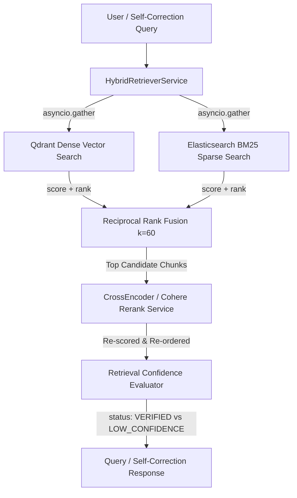

# Compass RAG: Retrieval Service (`compass-rag-retrieval`)

The **Retrieval Service** (`/services/retrieval`) provides production-grade multi-tenant indexing, hybrid vector + keyword search, exact Reciprocal Rank Fusion (RRF), Cross-Encoder re-ranking, and confidence evaluation for the Compass RAG platform.

---

## 🏗️ Architecture & Core Components



### 1. Embedding Service (`EmbeddingService`)
- **Providers Supported**: Offline Sentence Transformers (`all-MiniLM-L6-v2`) and OpenAI (`text-embedding-3-small`).
- **Redis Cache-Aside Wrapper**: Computes SHA-256 digest (`embed_cache:{provider}:{model}:{digest}`) for every text string. Hits Redis first to ensure zero duplicate embedding evaluations across identical chunks or repeated queries.

### 2. Dense Vector Store (`QdrantStoreService`)
- Indexes document chunks into **Qdrant** using Cosine similarity.
- Enforces strict multi-tenant isolation by requiring `tenant_id` filter conditions (`Filter(must=[FieldCondition(key="tenant_id", match=MatchValue(value=tenant_id))])`) on every query.

### 3. Sparse Keyword Store (`ElasticsearchStoreService`)
- Indexes exact chunk content into **Elasticsearch** for BM25 keyword matching.
- Enforces strict multi-tenant isolation by wrapping queries inside `{"bool": {"must": [...], "filter": [{"term": {"tenant_id": tenant_id}}]}}`.

### 4. Postgres Chunk Lineage Store (`PostgresChunkStore`)
- Transactionally records document chunks (`document_chunks` table) with full lineage (`document_id`, `chunk_index`, `embedding_provider`, `embedding_model`, `version_id`, `tenant_id`).

### 5. Reciprocal Rank Fusion Engine (`compute_rrf_fusion`)
- Implements the exact mathematical RRF formula:
  $$\text{score}(d) = \sum_{r \in R} \frac{1}{k + \text{rank}_r(d)}$$
  where $k=60$ (standard RRF smoothing constant) and $\text{rank}_r(d)$ is the 1-indexed position of document $d$ across Qdrant and Elasticsearch candidate lists.

### 6. Cross-Encoder Re-ranking Service (`RerankerService`)
- Re-scores top RRF candidate chunks using query-document semantic relevance:
  - **Local Mode**: `CrossEncoder("cross-encoder/ms-marco-MiniLM-L-6-v2")` offline scoring.
  - **Cohere Mode**: `cohere.Client.rerank("rerank-english-v3.0")` online API.

### 7. Retrieval Confidence Evaluator (`RetrievalConfidenceEvaluator`)
- Computes average re-ranked relevance score across top-K candidate results.
- Compares against `RETRIEVAL_CONFIDENCE_THRESHOLD` (`0.70`).
- Returns structured confidence transitions (`VERIFIED` vs `LOW_CONFIDENCE`) and reasoning to guide downstream self-correction loops.

---

## 🛠️ Configuration Settings

The service reads configuration directly from `shared.config.get_settings()` (`/shared/src/shared/config.py`) or `.env`:

| Variable | Default | Description |
| :--- | :--- | :--- |
| `EMBEDDING_PROVIDER` | `local` | Embedding engine provider (`local` or `openai`) |
| `LOCAL_EMBEDDING_MODEL` | `all-MiniLM-L6-v2` | SentenceTransformer model name |
| `OPENAI_EMBEDDING_MODEL` | `text-embedding-3-small` | OpenAI embedding model name |
| `RRF_K_CONSTANT` | `60` | Reciprocal Rank Fusion smoothing parameter |
| `RERANKER_PROVIDER` | `local` | Reranker provider (`local` CrossEncoder or `cohere`) |
| `LOCAL_RERANK_MODEL` | `cross-encoder/ms-marco-MiniLM-L-6-v2` | Local CrossEncoder model name |
| `COHERE_RERANK_MODEL` | `rerank-english-v3.0` | Cohere Rerank API model name |
| `RETRIEVAL_CONFIDENCE_THRESHOLD` | `0.70` | Minimum average score for `VERIFIED` status |

---

## 🧪 Testing & Verification

Run the comprehensive unit and integration verification suite:

```bash
# Run Phase 5 Hybrid Retrieval unit/integration tests
python -m uv run pytest tests/test_hybrid_retrieval.py -v

# Run full project test suite across all phases
python -m uv run pytest -v

# Verify syntax, code formatting, and strict type checking
python -m uv run ruff check .
python -m uv run mypy shared services tests --strict
```
